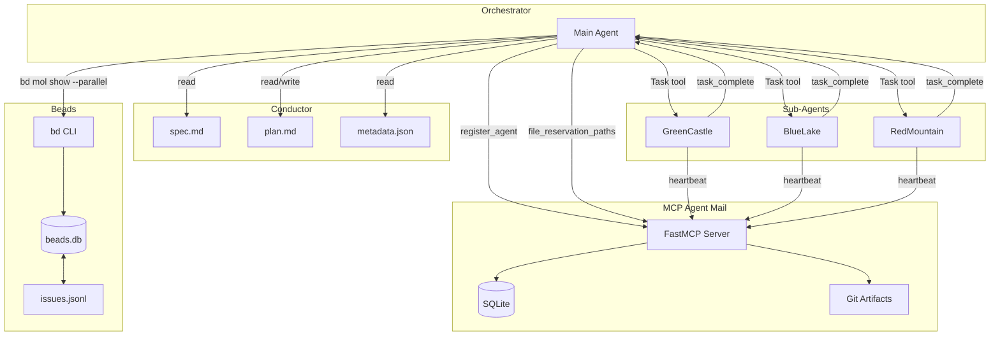

# Unified System Architecture: Conductor + Beads + MCP Agent Mail

## Executive Summary

This document provides a comprehensive overview of how **Conductor**, **Beads**, and **MCP Agent Mail** integrate to enable parallel, multi-agent task execution with dependency awareness and conflict-free coordination.

```
┌─────────────────────────────────────────────────────────────────────────────┐
│                         UNIFIED SYSTEM OVERVIEW                              │
├─────────────────────────────────────────────────────────────────────────────┤
│                                                                              │
│   CONDUCTOR                    BEADS                    MCP AGENT MAIL      │
│   ───────────                  ─────                    ──────────────      │
│   Context-Driven Dev           Dependency Graph         Agent Coordination  │
│   Spec-First Planning          Task Tracking            File Leases         │
│   TDD Workflow                 Parallel Detection       Messaging           │
│   Track Management             Git-Backed Storage       Identity System     │
│                                                                              │
│                              INTEGRATION                                     │
│                              ───────────                                     │
│   Track ←────────────────→ Epic                                             │
│   Plan Tasks ←───────────→ Beads Issues                                     │
│   Phase Dependencies ←───→ blocks/parent-child                              │
│   Parallel Groups ←──────→ bd mol show --parallel                           │
│   File Conflicts ←───────→ file_reservation_paths()                         │
│   Agent Messages ←───────→ send_message(thread_id="bd-###")                 │
│                                                                              │
└─────────────────────────────────────────────────────────────────────────────┘
```

---

## Part 1: Conductor (Context-Driven Development)

### Purpose
Conductor provides **spec-first, context-driven development** with TDD workflow and human-readable progress tracking.

### Core Artifacts

```
conductor/
├── product.md              # Product vision and goals
├── product-guidelines.md   # Brand/style guidelines  
├── tech-stack.md           # Technology choices
├── workflow.md             # TDD methodology
├── tracks.md               # Master track registry
├── beads.json              # Beads integration config
└── tracks/
    └── <track_id>/
        ├── metadata.json   # Track config + beads_epic ID
        ├── spec.md         # Requirements specification
        ├── plan.md         # Phased task list
        └── implement_state.json  # Resume state
```

### Track Lifecycle

```
┌─────────┐    ┌─────────┐    ┌─────────┐    ┌─────────┐
│  [ ]    │───▶│  [~]    │───▶│  [x]    │───▶│ Archive │
│  New    │    │ Active  │    │Complete │    │         │
└─────────┘    └─────────┘    └─────────┘    └─────────┘
      │              │              │
      │              ▼              │
      │        ┌─────────┐         │
      │        │  [!]    │         │
      └───────▶│ Blocked │─────────┘
               └─────────┘
```

### Task Workflow (Sequential - Current)

```python
# Current: One task at a time
for task in plan_tasks:
    mark_in_progress(task)      # [~]
    write_failing_tests()        # TDD Red
    implement_to_pass()          # TDD Green
    refactor()                   # TDD Refactor
    verify_coverage()            # >80%
    commit_with_notes()          # Git
    mark_complete(task)          # [x]
    update_beads()               # bd close
```

### Key Commands

| Command | Purpose |
|---------|---------|
| `/conductor-setup` | Initialize project with context files |
| `/conductor-newtrack` | Create feature/bug track with spec and plan |
| `/conductor-implement` | Execute tasks from plan (sequential) |
| `/conductor-status` | Display progress overview |
| `/conductor-block` | Mark task as blocked |
| `/conductor-revise` | Update spec/plan when issues found |

---

## Part 2: Beads (Dependency-Aware Task Graph)

### Purpose
Beads provides **persistent, git-backed task tracking** with dependency graph for multi-agent orchestration.

**Two Tools:**
- **bd** (Beads CLI): Mutating operations (create, update, close) - [github.com/steveyegge/beads](https://github.com/steveyegge/beads)
- **bv** (Beads Viewer): Read-only analysis, parallel planning, graph metrics - [github.com/Dicklesworthstone/beads_viewer](https://github.com/Dicklesworthstone/beads_viewer)

### Architecture

```
┌─────────────────────────────────────────────────────────────────────────┐
│                           BEADS ECOSYSTEM                                │
├─────────────────────────────────────────────────────────────────────────┤
│                                                                          │
│   ┌─────────────────┐                    ┌─────────────────┐            │
│   │   bd (CLI)      │                    │   bv (Viewer)   │            │
│   │   WRITE OPS     │                    │   READ-ONLY     │            │
│   │                 │                    │                 │            │
│   │ • create        │                    │ • --robot-plan  │            │
│   │ • update        │                    │ • --robot-priority│          │
│   │ • close         │                    │ • --robot-insights│          │
│   │ • dep add       │                    │ • --robot-diff  │            │
│   │ • sync          │                    │ • --robot-recipes│           │
│   └────────┬────────┘                    └────────┬────────┘            │
│            │                                      │                      │
│            │         ┌─────────────────┐          │                      │
│            └────────▶│ .beads/         │◀─────────┘                      │
│                      │ issues.jsonl    │                                 │
│                      │ (Git-tracked)   │                                 │
│                      └────────┬────────┘                                 │
│                               │                                          │
│                      ┌────────▼────────┐                                 │
│                      │   SQLite        │                                 │
│                      │   beads.db      │                                 │
│                      │   (Local cache) │                                 │
│                      └─────────────────┘                                 │
└─────────────────────────────────────────────────────────────────────────┘
```

### Data Model

```go
type Issue struct {
    ID          string      // Hash-based: "bd-a1b2"
    Title       string
    Status      string      // open|in_progress|blocked|closed
    Priority    int         // P0 (critical) to P4 (backlog)
    IssueType   string      // bug|feature|task|epic
    Dependencies []Dependency
}

type Dependency struct {
    IssueID     string
    DependsOnID string
    Type        string      // blocks|parent-child|discovered-from|related
}
```

### Dependency Types

| Type | Affects Ready? | Semantics |
|------|----------------|-----------|
| `blocks` | ✅ YES | B can't start until A closes |
| `parent-child` | ✅ YES | Children inherit parent blocks |
| `conditional-blocks` | ✅ YES | B runs only if A fails |
| `waits-for` | ✅ YES | Fanout gate: wait for children |
| `discovered-from` | ❌ No | Found during work (audit trail) |
| `related` | ❌ No | Soft link |

### Parallel Detection Algorithm

```python
# bd mol show <epic> --parallel --json
def analyze_parallel(subgraph):
    # 1. Build blocking maps
    blocked_by = compute_transitive_blocks(subgraph)
    
    # 2. Calculate depth (distance from root)
    depths = calculate_blocking_depths(subgraph)
    
    # 3. Group by depth - same depth can parallelize
    depth_groups = group_by_depth(depths)
    
    # 4. Within each depth, merge non-blocking tasks
    for depth, tasks in depth_groups:
        parallel_groups = union_find_non_blocking(tasks)
    
    return {
        "parallel_groups": {
            "group-1": ["bd-task1", "bd-task2", "bd-task3"],
            "group-2": ["bd-task4", "bd-task5"]
        },
        "steps": {
            "bd-task1": {
                "is_ready": True,
                "can_parallel": ["bd-task2", "bd-task3"]
            }
        }
    }
```

### bd Commands (Mutating)

| Command | Purpose |
|---------|---------|
| `bd ready` | Show tasks with no open blockers |
| `bd create "Title" -p 1` | Create new task |
| `bd update <id> --status in_progress` | Start working |
| `bd close <id> --reason "Done"` | Complete task |
| `bd dep add <child> <parent>` | Add dependency |
| `bd sync` | Sync with git remote |

### bv Commands (Read-Only Analysis)

| Command | Purpose | Output |
|---------|---------|--------|
| `bv --robot-plan` | **Parallel track planning** | Tracks with unblocks info |
| `bv --robot-priority` | Priority recommendations | Suggested priority changes |
| `bv --robot-insights` | Full graph metrics | PageRank, betweenness, cycles |
| `bv --robot-diff --diff-since <ref>` | Historical comparison | New/closed/modified issues |
| `bv --robot-recipes` | Available filters | Built-in + custom filters |

### bv --robot-plan Output Structure

```json
{
  "generated_at": "2024-01-15T10:30:00Z",
  "plan": {
    "tracks": [
      {
        "track_id": "track-A",
        "items": [
          {
            "id": "bd-123",
            "title": "Implement auth middleware",
            "priority": 1,
            "status": "open",
            "unblocks": ["bd-124", "bd-125"]
          }
        ],
        "reason": "Independent work stream"
      },
      {
        "track_id": "track-B",
        "items": [
          {"id": "bd-200", "unblocks": ["bd-201"]}
        ]
      }
    ],
    "total_actionable": 15,
    "total_blocked": 23,
    "summary": {
      "highest_impact": "bd-123",
      "impact_reason": "Unblocks 5 tasks",
      "unblocks_count": 5
    }
  }
}
```

### bv --robot-insights Output Structure

```json
{
  "insights": {
    "Bottlenecks": [{"id": "bd-123", "value": 15.7}],
    "Keystones": [{"id": "bd-124", "value": 10}],
    "Influencers": [{"id": "bd-125", "value": 0.42}],
    "Hubs": [{"id": "bd-126", "value": 0.88}],
    "Authorities": [{"id": "bd-127", "value": 0.91}],
    "Articulation": ["bd-129", "bd-130"],
    "Cycles": [["bd-132", "bd-133", "bd-132"]]
  },
  "full_stats": {
    "pagerank": {"bd-123": 0.15, "bd-124": 0.12},
    "betweenness": {"bd-123": 15.7},
    "critical_path_score": {"bd-124": 10}
  }
}
```

---

## Part 3: MCP Agent Mail (Coordination Layer)

### Purpose
MCP Agent Mail provides **agent coordination primitives**: identities, file leases, messaging, and pre-commit enforcement for multi-agent workflows.

### Setup

#### One-Line Installation

```bash
curl -fsSL https://raw.githubusercontent.com/Dicklesworthstone/mcp_agent_mail/main/install.sh | bash
```

This installs:
- Python 3.14 venv + MCP HTTP server on port 8765
- Auto-configures Claude Code, Codex CLI, Gemini CLI
- Installs `bd` and `bv` automatically
- Creates `am` alias for quick startup

#### Starting the Server

```bash
am              # Uses the shell alias
am --port 8766  # Custom port
```

#### Client Integration

The installer auto-detects and configures supported tools. For manual setup:

| Tool | Script | Config File |
|------|--------|-------------|
| Claude Code | `scripts/integrate_claude_code.sh` | `.claude/settings.json` |
| Codex CLI | `scripts/integrate_codex_cli.sh` | `~/.codex/config.toml` |
| Gemini CLI | `scripts/integrate_gemini_cli.sh` | `~/.gemini/settings.json` |

#### Amp Code Integration

Amp supports HTTP-based MCP servers natively:

**Option 1: CLI**
```bash
amp mcp add agent-mail http://127.0.0.1:8765/mcp/
```

**Option 2: Workspace Settings** (`.amp/settings.json`)
```json
{
  "amp.mcpServers": {
    "agent-mail": {
      "url": "http://127.0.0.1:8765/mcp/"
    }
  }
}
```

**Option 3: Global Settings** (`~/.amp/settings.json`)
```json
{
  "amp.mcpServers": {
    "agent-mail": {
      "url": "http://127.0.0.1:8765/mcp/"
    }
  }
}
```

### Architecture

```
┌─────────────────────────────────────────────────────────────┐
│                    FastMCP HTTP Server                       │
│                    POST /mcp/ (JSON-RPC)                     │
├─────────────────────────────────────────────────────────────┤
│                                                              │
│  ┌──────────────┐  ┌──────────────┐  ┌──────────────┐       │
│  │   Identity   │  │   Messaging  │  │ File Leases  │       │
│  │              │  │              │  │              │       │
│  │ GreenCastle  │  │   Inbox      │  │  Exclusive   │       │
│  │ BlueLake     │  │   Outbox     │  │  Shared      │       │
│  │ RedMountain  │  │   Threads    │  │  TTL         │       │
│  └──────────────┘  └──────────────┘  └──────────────┘       │
│                                                              │
├─────────────────────────────────────────────────────────────┤
│  SQLite (indexing)          Git Repo (audit trail)          │
│  agents, messages,          agents/, messages/,             │
│  file_reservations          file_reservations/              │
└─────────────────────────────────────────────────────────────┘
```

### Agent Identity System

```python
# Registration
register_agent(
    project_key="/path/to/project",
    program="conductor-beads",
    model="claude-sonnet",
    name="GreenCastle"  # Adjective + Noun pattern
)

# Properties
Agent:
    name: str              # "GreenCastle"
    program: str           # "conductor-beads"
    model: str             # "claude-sonnet"
    contact_policy: str    # "open"|"auto"|"contacts_only"|"block_all"
    last_active_ts: datetime
```

### File Reservation System

```python
# Request exclusive lease
file_reservation_paths(
    project_key="/path/to/project",
    agent_name="GreenCastle",
    paths=["src/auth/**/*.ts", "tests/auth/**/*.ts"],
    ttl_seconds=3600,
    exclusive=True,
    reason="bd-a1b2: Implement auth module"
)

# Response
{
    "granted": [
        {"path_pattern": "src/auth/**/*.ts", "expires_at": "...", "id": 42}
    ],
    "conflicts": [
        {"path_pattern": "src/auth/**/*.ts", "holder": "BlueLake", "expires_at": "..."}
    ]
}
```

**Lease Semantics:**
- **Advisory model**: Always grants, but surfaces conflicts
- **Pre-commit enforcement**: Hook blocks commits on lease violations
- **TTL with renewal**: Heartbeats extend lease duration
- **Git wildmatch patterns**: Supports `**/*.ts`, `src/{api,lib}/**`

### Messaging Protocol

```python
# Send message linked to Beads task
send_message(
    project_key="/path/to/project",
    sender_name="GreenCastle",
    to=["BlueLake", "RedMountain"],
    subject="[bd-a1b2] Starting auth implementation",
    body_md="## Progress\n- Setting up test fixtures\n- ...",
    thread_id="bd-a1b2",  # Links to Beads task
    importance="high",
    ack_required=True
)

# Fetch inbox
fetch_inbox(
    project_key="/path/to/project",
    agent_name="BlueLake",
    limit=20,
    urgent_only=False
)

# Acknowledge
acknowledge_message(
    project_key="/path/to/project",
    agent_name="BlueLake",
    message_id=123
)
```

### Pre-Commit Hook

```bash
# Installed by install_precommit_guard()
# .git/hooks/pre-commit → hooks.d/pre-commit/50-agent-mail.py

# Logic:
# 1. Get staged files
git diff --cached --name-status -M -z

# 2. Check against active reservations
for reservation in active_reservations:
    if reservation.exclusive and reservation.holder != $AGENT_NAME:
        if pathspec.match(staged_file, reservation.pattern):
            ERROR: "Conflict with {holder}'s lease on {pattern}"
            exit 1

# Environment variables:
# AGENT_NAME=GreenCastle (required)
# AGENT_MAIL_GUARD_MODE=warn (advisory) or error (strict)
# AGENT_MAIL_BYPASS=1 (emergency override)
```

### Key Tools

| Tool | Purpose |
|------|---------|
| `register_agent` | Create agent identity |
| `file_reservation_paths` | Request file lease |
| `release_file_reservations` | Release lease |
| `renew_file_reservations` | Extend TTL |
| `send_message` | Send to agent inbox |
| `fetch_inbox` | Check messages |
| `acknowledge_message` | Confirm receipt |
| `install_precommit_guard` | Set up hook |
| `request_contact` | Cross-project link request |
| `respond_contact` | Approve/deny link |

---

## Part 4: Integration Architecture

### Data Flow

```
┌─────────────────────────────────────────────────────────────────────────┐
│                              CONDUCTOR                                   │
│                                                                          │
│   conductor/tracks/<track_id>/                                          │
│   ├── metadata.json ─────────────────┐                                  │
│   │   {                              │                                  │
│   │     "beads_epic": "bd-epic1",    │                                  │
│   │     "beads_tasks": {             │                                  │
│   │       "phase1_task1": "bd-a1b2", ├──────┐                          │
│   │       "phase1_task2": "bd-xyz7"  │      │                          │
│   │     }                            │      │                          │
│   │   }                              │      │                          │
│   └── plan.md                        │      │                          │
│       ## Phase 1                     │      │                          │
│       - [~] Task 1 (abc1234)         │      │                          │
│       - [ ] Task 2                   │      │                          │
└──────────────────────────────────────┼──────┼──────────────────────────┘
                                       │      │
                                       ▼      ▼
┌─────────────────────────────────────────────────────────────────────────┐
│                                BEADS                                     │
│                                                                          │
│   .beads/issues.jsonl                                                   │
│   {"id":"bd-epic1","type":"epic","title":"Auth Feature",...}            │
│   {"id":"bd-a1b2","type":"task","parent":"bd-epic1","status":"open"}    │
│   {"id":"bd-xyz7","type":"task","parent":"bd-epic1","deps":["bd-a1b2"]} │
│                                                                          │
│   bd mol show bd-epic1 --parallel --json                                │
│   → {"parallel_groups": {"g1": ["bd-a1b2"], "g2": ["bd-xyz7"]}}         │
└──────────────────────────────────────┬──────────────────────────────────┘
                                       │
                                       ▼
┌─────────────────────────────────────────────────────────────────────────┐
│                           MCP AGENT MAIL                                 │
│                                                                          │
│   Agents: GreenCastle, BlueLake                                         │
│   Leases:                                                                │
│     GreenCastle → src/auth/login.ts (exclusive, reason: "bd-a1b2")      │
│     BlueLake    → src/auth/register.ts (exclusive, reason: "bd-xyz7")   │
│   Messages:                                                              │
│     thread_id: "bd-a1b2" → "[bd-a1b2] Starting login implementation"    │
│     thread_id: "bd-xyz7" → "[bd-xyz7] Starting register implementation" │
└─────────────────────────────────────────────────────────────────────────┘
```

### Mapping Table

| Conductor | Beads | MCP Agent Mail |
|-----------|-------|----------------|
| Track | Epic | - |
| Phase | Dependency depth | Parallel group |
| Task | Issue (task type) | Thread ID |
| plan.md markers | Status (open/in_progress/closed) | - |
| - | `bd mol show --parallel` | Lease allocation |
| - | `bd-###` task ID | `thread_id`, `reason` field |
| implement_state.json | - | Heartbeat monitoring |

### Parallel Execution Flow

```
┌─────────────────────────────────────────────────────────────────────────┐
│                         ORCHESTRATOR                                     │
│                   (conductor-implement --parallel)                       │
├─────────────────────────────────────────────────────────────────────────┤
│                                                                          │
│  1. Load track context                                                  │
│     ├── conductor/tracks/<track>/spec.md                                │
│     ├── conductor/tracks/<track>/plan.md                                │
│     └── conductor/tracks/<track>/metadata.json (beads_epic, beads_tasks)│
│                                                                          │
│  2. Query parallel groups                                               │
│     └── bd mol show <beads_epic> --parallel --json                      │
│         → {"parallel_groups": {"g1": ["bd-a1b2", "bd-xyz7"], ...}}      │
│                                                                          │
│  3. For each parallel group, spawn agents                               │
│     ├── register_agent() → GreenCastle                                  │
│     ├── file_reservation_paths() → exclusive leases                     │
│     └── Task(prompt="Execute bd-a1b2 with TDD workflow")                │
│                                                                          │
│  4. Monitor agent messages                                              │
│     ├── heartbeat → refresh leases                                      │
│     ├── task_complete → merge, update plan.md, bd close                 │
│     └── task_blocked → mark [!], bd update --status blocked             │
│                                                                          │
│  5. Phase completion                                                    │
│     ├── Merge all agent branches                                        │
│     ├── Run integration tests                                           │
│     ├── Create checkpoint commit                                        │
│     └── Update plan.md with checkpoint SHA                              │
│                                                                          │
└─────────────────────────────────────────────────────────────────────────┘
```

---

## Part 5: Implementation Considerations

### Prerequisites

| Component | Requirement | Installation |
|-----------|-------------|--------------|
| Beads CLI | `bd --version` ≥ 0.34.0 | `go install github.com/steveyegge/beads/cmd/bd@latest` |
| MCP Agent Mail | Server running on port 8765 | See [mcp_agent_mail](https://github.com/Dicklesworthstone/mcp_agent_mail) |
| Git | Worktrees support | Standard git |

### Configuration Files

**conductor/beads.json:**
```json
{
  "enabled": true,
  "auto_sync": true,
  "epic_prefix": "conductor"
}
```

**conductor/agent_mail.json (new):**
```json
{
  "enabled": true,
  "server_url": "http://127.0.0.1:8765/mcp/",
  "max_agents": 3,
  "lease_ttl_seconds": 3600,
  "pre_commit_guard": true
}
```

### State Management

**Sequential Mode (current):**
```
conductor/tracks/<track>/implement_state.json
```

**Parallel Mode (new):**
```
conductor/tracks/<track>/implement_parallel_state.json
{
  "mode": "parallel",
  "max_agents": 3,
  "agents": {
    "GreenCastle": {
      "task_id": "bd-a1b2",
      "plan_key": "phase1_task1",
      "status": "running-green",
      "leases": ["src/auth/login.ts"],
      "worktree": "worktrees/<track>/phase1_task1"
    }
  },
  "tasks": {
    "phase1_task1": {"status": "in_progress", "agent_id": "GreenCastle"},
    "phase1_task2": {"status": "pending", "deps": ["phase1_task1"]}
  }
}
```

### Git Worktree Strategy

```bash
# Orchestrator creates worktrees for each parallel task
git worktree add worktrees/<track>/phase1_task1 -b track/<track>/phase1_task1
git worktree add worktrees/<track>/phase1_task2 -b track/<track>/phase1_task2

# Agents work in isolation
cd worktrees/<track>/phase1_task1
# ... TDD workflow ...
git commit -m "feat(auth): Implement login [Task-Id: bd-a1b2]"

# Orchestrator merges after completion
git checkout track/<track>/integration
git merge track/<track>/phase1_task1 --no-ff
git merge track/<track>/phase1_task2 --no-ff
```

### Error Handling Matrix

| Error Type | Detection | Recovery |
|------------|-----------|----------|
| Lease conflict | `conflicts` in response | Queue task, or split files |
| Agent stall | Missing heartbeats | Rollback worktree, reassign |
| Merge conflict | Git merge fails | Create resolution task |
| Test failure | Agent reports | Retry (2x), then block |
| Beads command fail | Non-zero exit | Offer: continue/retry/halt |

---

## Part 6: API Reference Summary

### Beads Commands for Parallel Execution

```bash
# Get parallel groups for an epic
bd mol show <epic-id> --parallel --json

# Get ready tasks
bd ready --json --limit 10

# Claim task
bd update <task-id> --status in_progress --assignee <agent-name>

# Complete task
bd close <task-id> --reason "Completed: commit <sha>"

# Add discovered work
bd create "New task" --parent <epic-id> -p 2
bd dep add <new-id> <current-id> --type discovered-from
```

### MCP Agent Mail Tools for Coordination

```python
# Identity
register_agent(project_key, program, model, name)

# Leases
file_reservation_paths(project_key, agent_name, paths, ttl_seconds, exclusive, reason)
release_file_reservations(project_key, agent_name, paths)
renew_file_reservations(project_key, agent_name, ttl_seconds)

# Messaging
send_message(project_key, sender_name, to, subject, body_md, thread_id, importance, ack_required)
fetch_inbox(project_key, agent_name, limit, urgent_only)
acknowledge_message(project_key, agent_name, message_id)

# Hooks
install_precommit_guard(project_key, code_repo_path)
```

---

## Appendix: Diagrams

### System Interaction Diagram



### Parallel Task Execution Timeline

```mermaid
gantt
    title Parallel Task Execution with 3 Agents
    dateFormat HH:mm
    axisFormat %H:%M
    
    section Orchestrator
    Load Context           :done, o1, 09:00, 5m
    Query Parallel Groups  :done, o2, 09:05, 2m
    Spawn Agents          :done, o3, 09:07, 3m
    Monitor & Merge       :active, o4, 09:10, 50m
    Phase Checkpoint      :o5, 10:00, 10m
    
    section GreenCastle
    Reserve Leases        :done, a1, 09:07, 1m
    TDD: Login Module     :done, a2, 09:08, 25m
    Commit & Report       :done, a3, 09:33, 2m
    
    section BlueLake
    Reserve Leases        :done, b1, 09:07, 1m
    TDD: Register Module  :done, b2, 09:08, 30m
    Commit & Report       :done, b3, 09:38, 2m
    
    section RedMountain
    Reserve Leases        :done, c1, 09:07, 1m
    TDD: Password Reset   :done, c2, 09:08, 35m
    Commit & Report       :done, c3, 09:43, 2m
```

---

## Next Steps

1. **Implement `conductor-implement-parallel.md`** command
2. **Create MCP Agent Mail client wrapper** for Conductor
3. **Add parallel state management** to Conductor skill
4. **Update workflow.md** with parallel mode section
5. **Write integration tests** for multi-agent scenarios
